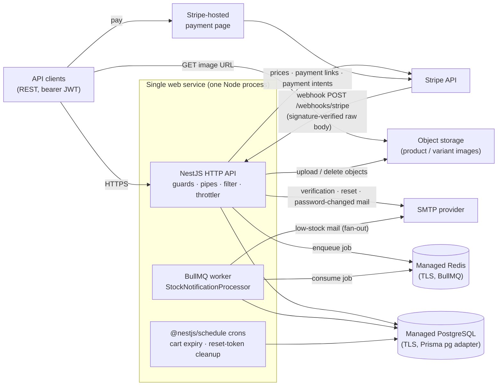

# Architecture

A NestJS + Prisma + PostgreSQL REST API for a T-shirt store: catalog with
size/color/fit/gender variants (SKUs), liked products, cart, Stripe checkout,
and order history with a `pending → paid → processing → shipped` / `cancelled`
flow. The data model lives in [`db-schema.md`](./db-schema.md), the HTTP
contract in [`openapi.yaml`](./openapi.yaml), and every closed design decision
in [`implementation-notes.md`](./implementation-notes.md) — this document
covers the runtime shape.

## Request path

```
client → helmet → CORS → ThrottlerGuard → JwtAuthGuard (Passport)
       → RolesGuard / PoliciesGuard (CASL) → ValidationPipe
       → controller → service → PrismaService → Postgres
       → ClassSerializerInterceptor → AllExceptionsFilter → response
```

Cross-cutting pieces, all registered globally:

- **`helmet()` + CORS** in `src/main.ts`; CSP is relaxed only outside
  production, because Swagger UI is mounted at `/docs` in development only.
  `app.set('trust proxy', true)` so `req.ip` is the real client behind the
  platform's edge proxy (why `true` and not a hop count: `implementation-notes.md`
  §4, Deployment).
- **`ThrottlerGuard`** as an `APP_GUARD` with an env-configured global bucket,
  plus a much stricter `@Throttle()` on `/auth/signin`, `/auth/forgot-password`
  and `/auth/reset-password`, where the traffic worth rate-limiting is
  credential guessing rather than volume.
- **Auth**: stateless bearer JWT via a Passport `JwtStrategy`; `LocalStrategy`
  only for sign-in. No session store and no revocation list — token lifetime is
  the revocation mechanism, which keeps every instance able to authenticate a
  request with no shared state.
- **Authorization**: `RolesGuard` for coarse role checks, `PoliciesGuard` +
  `CaslAbilityFactory` for the ability rules (`src/casl/`). Ownership checks that
  CASL can't express from the token alone are enforced in the services, next to
  the query that loads the row.
- **`ValidationPipe`** with `whitelist`, `forbidNonWhitelisted`, `transform`, so
  unknown fields are a 400 rather than silently dropped.
- **`AllExceptionsFilter`** as the single response shape, mapping Prisma error
  codes (`P2002` → 409, `P2025` → 404) and collapsing anything unmapped to a
  logged 500.
- **Config**: `ConfigModule` with a Joi schema (`src/config/env.validation.ts`);
  the process refuses to boot on a missing or malformed variable, so
  misconfiguration is a startup failure rather than a runtime surprise.

## Production topology



The worker and the crons run **in-process**: `StockNotificationProcessor` is a
plain provider registered in `StockNotificationModule`, and `ScheduleModule.forRoot()`
runs the crons on the same event loop as the HTTP server. One process is the
right unit at this size — it keeps deployment, configuration and log aggregation
to a single service — and because the queue lives in Redis rather than in memory,
splitting the worker into its own entrypoint later is a deployment change, not a
code change.

**Where order state changes.** `CheckoutService` creates the `pending` order
(keyed by a required `Idempotency-Key`, persisted unique on the order) and talks
to Stripe. The **only** `pending → paid` transition is
`WebhooksService.handleStripeEvent` on `checkout.session.completed` /
`payment_intent.succeeded`; it verifies the Stripe signature over the raw body,
then does an `updateMany` filtered on `status = pending`, so a redelivered event
updates zero rows and the stock decrement does not run twice. Manager-driven
`paid → processing → shipped` and cancellation live in `OrdersService`.

## Why a queue for stock notification, and cron for the sweeps

`implementation-notes.md` §11 records the course's rule and this project applies
it verbatim: **queue** when the work must survive a restart or be retried,
**cron** when it is a clock sweep, **events never** for anything that must not be
lost. The two background paths here land on opposite sides of that rule, and the
reasons are worth stating precisely, because they are what makes the choice
mechanical rather than stylistic.

The low-stock notification is a queue job (`BullMQ`, one queue, `attempts` +
exponential `backoff` from env) because every property it needs is a queue
property:

- **Retries against an unreliable dependency.** It sends SMTP mail. A refused
  connection or a rate-limited relay is transient and must be retried with
  backoff — neither a cron tick nor an event listener gives you that.
- **Durability.** It is triggered from a Stripe webhook. The trigger is a state
  *change*, not a state, so it cannot be re-derived after the fact: the stock
  value has already been decremented, so nothing would ever fire a second time.
  An in-memory `EventEmitter` listener would lose the notification on a restart
  mid-send; Redis holds the job across it.
- **Fan-out.** One SKU crossing the threshold means N emails — every user who
  liked the product and has not bought it (the query is in
  `StockNotificationService.notifyLikersOfLowStock`). N is unbounded and grows
  with the catalog's popularity, so the unit of work is exactly what a queue is
  built to absorb.
- **Not blocking the webhook response.** Stripe expects a fast 200 and retries on
  timeout. Sending N emails inline would make the webhook's latency a function of
  the mailer's, and a slow relay would turn into duplicate Stripe deliveries —
  a correctness problem, not just a latency one. Enqueue-and-return decouples the
  two.
- **Idempotency and visibility.** The processor never swallows its exception (a
  silent `catch` would mark the job `completed` and kill the retry, per §11); the
  give-up path is logged from `@OnWorkerEvent('failed')`. The payload is just a
  `skuId`, so a retry re-reads current state instead of replaying a stale
  recipient list — the job is a pointer, not a snapshot.

Cart expiry and reset-token cleanup are `@Cron(EVERY_HOUR)` sweeps instead, for
the mirror-image reasons:

- They are pure "flip rows whose timestamp has passed" queries with no external
  dependency, so there is no failure worth retrying — the work is derived from
  the clock, not from an event that can be lost.
- They are self-healing: a missed tick is fixed by the next one. Cart expiry has
  a second guarantee on top, independent of the schedule — `CheckoutService`
  expires stale carts lazily before creating an order, since
  `one_active_cart_per_user` would otherwise reject the insert. Correctness of
  the checkout path therefore never depends on a cron having fired.
- Both are idempotent, which is what makes running them alongside every API
  instance safe rather than something to coordinate.
- Both wrap their body in try/catch and log, because `@nestjs/schedule`
  otherwise swallows the failure.

Putting the sweeps on a queue would add a Redis dependency to queries that
already cannot lose anything. The queue's dependency is paid for once, by the one
path that needs delivery guarantees.

## Deploy shape

One **web service** running `npm run start:prod` (`node dist/main`) against a
**managed Postgres** and a **managed Redis**, with **object storage** for images,
plus Stripe (test mode) and an SMTP sandbox. Concrete provider choices, the
free-tier reasoning behind each, and the full TLS checklist are in
[`deployment-plan.md`](./deployment-plan.md); nothing account-specific is
repeated here.

- Build runs `npm ci && npm run build`; `postinstall` runs `prisma generate`,
  which is required because the Prisma client is generated into
  `src/generated/prisma` and gitignored.
- Schema changes are applied with **`prisma migrate deploy`** — never
  `db push` (`implementation-notes.md` §1), because the hand-edited partial
  indexes and CHECK constraints in the migration SQL are not derivable from
  `schema.prisma`. It is run as an operator step against the database, which
  keeps a migration an explicit action rather than something a redeploy can
  trigger implicitly.
- Postgres is reached over TLS through the Prisma `pg` adapter, with optional
  `DATABASE_CA_CERT_PATH` for strict verification. A direct connection was the
  intended choice — at one small instance a pooler buys nothing and costs a
  second `DIRECT_URL` for migrations — but the provider's direct hostname
  resolves to an IPv6-only address the platform's egress cannot reach, so the
  deployment uses the provider's **session pooler** endpoint for IPv4
  reachability (`deployment-plan.md`, Step 2). Connection limits are therefore
  set by a single instance's Prisma pool against the managed database's ceiling.
- Swagger UI is not exposed, because it is gated on `NODE_ENV=development`; the
  checked-in `openapi.yaml` is the contract a reviewer reads, and production
  serves no interactive documentation surface and needs no CSP relaxation for it.
- The free web tier sleeps when idle, so crons do not tick while the process is
  asleep. That is why cart expiry is also enforced lazily in the checkout path:
  the invariant is guaranteed by the write path, and the sweep is only an
  optimization on top of it.
- Free-tier Postgres auto-pauses after long inactivity, which `GET /health`
  surfaces as a 503 rather than a silent hang.

## Observability: what the system exposes, and what I would monitor

`GET /health` (`src/health/health.controller.ts`) is a **liveness** check: it runs
`SELECT 1` against Postgres through the same Prisma connection the request path
uses, so it answers "this process is up and its database is reachable" — which is
the correct question for a restart decision. A fuller **readiness** probe would
extend that with a Redis ping and queue reachability, reported as a separate
endpoint from liveness so that a degraded mailer or a slow queue never gets the
instance restarted out from under healthy traffic.

Beyond that, the signals I would watch map onto this system's real failure modes:

- **Webhook signature-verification failures** — the `400` rate on
  `POST /webhooks/stripe`. A rotated or mismatched signing secret stops every
  payment from settling while producing no user-visible error, so this is the
  highest-value single alert in the system.
- **Orders stuck in `pending`** past a short threshold — the best end-to-end
  proxy for "checkout is broken", whatever the cause (webhook undelivered,
  signing secret wrong, instance asleep, Stripe metadata missing an `orderId`,
  which the handler logs as a warning).
- **5xx from the webhook route specifically**, not just in aggregate. The
  `chk_stock_non_negative` constraint means an oversell attempt raises a Prisma
  error inside the handler, and the constraint is deliberately the last line of
  defense — a 5xx there is the signal that stock arithmetic and reality have
  diverged, and it deserves its own alert rather than being averaged into the
  overall error rate.
- **BullMQ queue depth: failed and waiting.** Failed-job count stands in for a
  dead-letter queue, and a rising `waiting` count against a flat `completed`
  count is the signature of a starved worker or an unreachable Redis.
- **SMTP send failure rate.** `MailService` catches and logs its own send errors
  so a broken mailer degrades gracefully instead of failing signups; the trade is
  that the log line is the signal, and it should be alerted on rather than merely
  collected.
- **Stripe API error rate and latency** on `prices.create`, `paymentLinks.create`
  and `paymentIntents.create` — these calls are inline in the checkout request,
  so Stripe's latency is the user's latency.
- **p95 latency and 5xx rate per route**, plus **429 volume per route**. A spike
  on `/auth/*` distinguishes a credential-stuffing attempt from a throttle set
  too tight for a legitimate client, and a 429 spike immediately after a deploy
  points at proxy trust: if `trust proxy` stops resolving the real client IP,
  every client shares one bucket.
- **Postgres connection-pool saturation and active connections**, since the
  ceiling is a single instance's pool against the managed database's limit.
- **Cron last-success timestamps** for both sweeps — a cron that never runs emits
  nothing, so the absence of a recent success is the only observable form of that
  failure.
